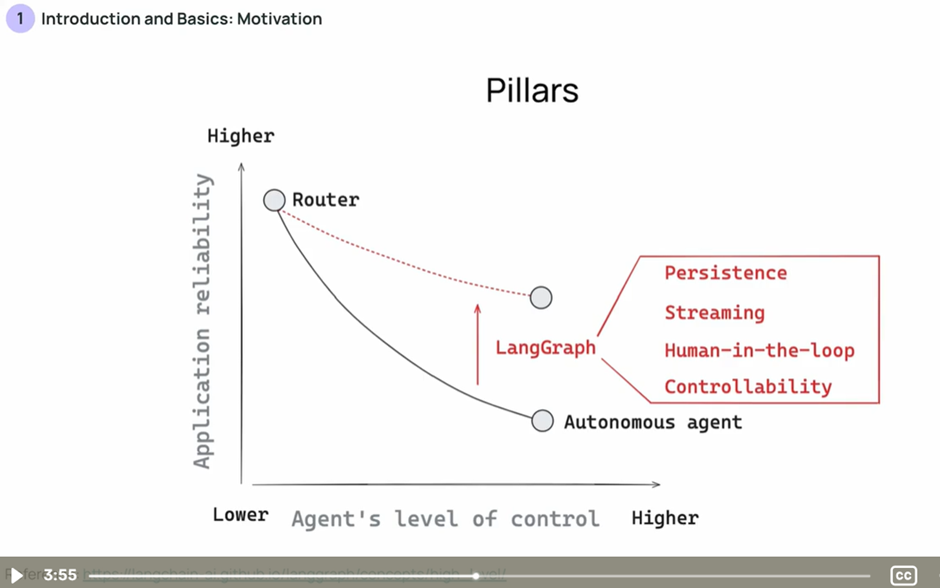
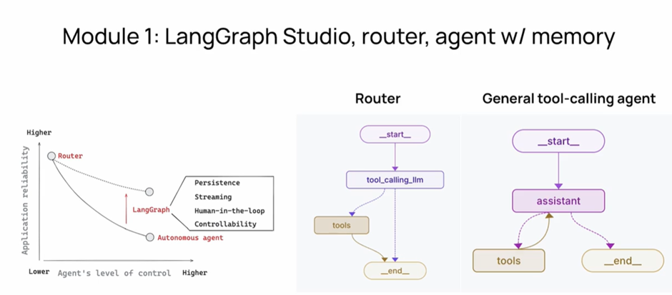
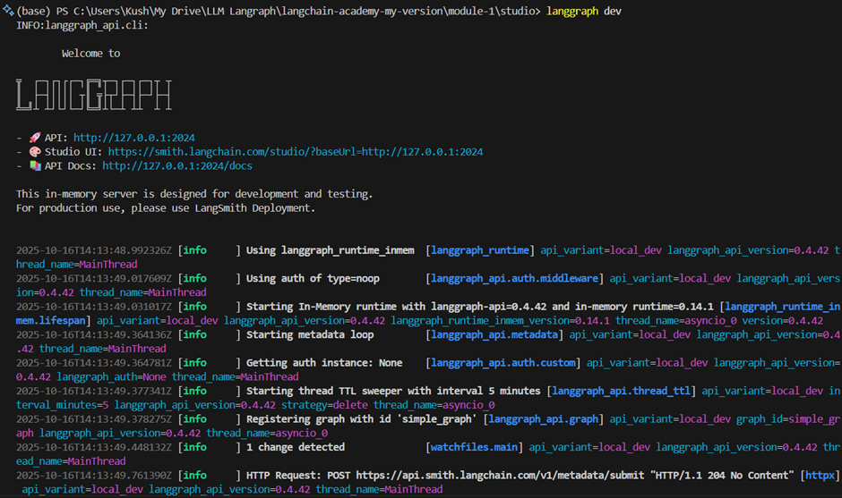
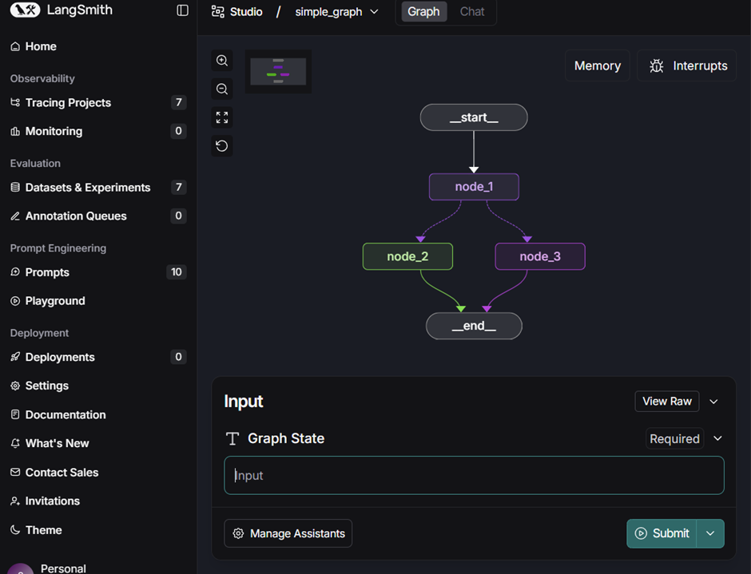
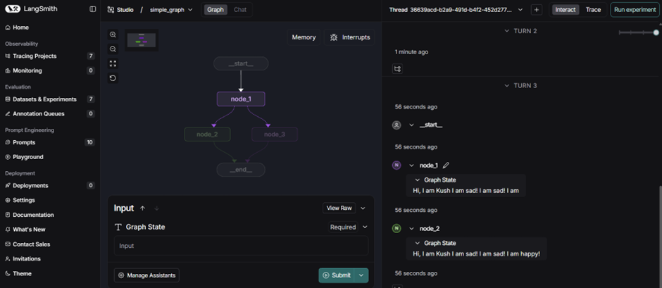
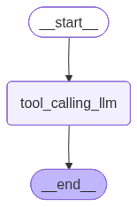

# Kush-Sahni-2210110371-Langgraph-MAT496

**Module 0**

**Setup**

Set up all the API keys of Langsmith, OpneAI, TAVILY (a toll for Web Search), set TRACING =true and Langsmith Project
Learnt about the course structure for each module
Learnt that Langraph is a useful tool for visualizing and creating multi-agent workflows which interact with Human or each other
Run my own custom fun prompts and used messages, tools for websearch

**Module 1**

**Video - 1 : Motivation**

**Learnings:**
Basic Motivation

Learnt the basic difference between an agent and a chain, what really an agent is it can choose its own set of steps to perform from and we can diaa th autonomous natre of the agent from a Router to a Autonimous agent

Langgraph helps in balancing the reliability even if we increse the autonomy of an agent

Langgraph has these 4 things in it:
Persistence
Streaming
Human-Control in the loop
Controllability

What I'll be learning in each module, got an idea:
 

Module 1:

Module 2:
 

Module 3 concepts
:
 

Module 4:
 

**Tasks I did:** Only Motivation, no notebook/ code implementation part here

**Video 2 : Simple Graph**

**Learnings:**

Learnt about Nodes(compontents like Tools, web search , vector database), Edges (Conditional Decision Statement like Mood in this example notebook)
Also about Graph states
I learnt a basic RAG application which 50% times goes toNode 1 or Node 3
Node 2 appends I am happy!
Node 3 appends I am sad!
Defination of Agent workflow

**Tasks I did:**

Altered the User input which is in the Dictionary key-value pair format initial GraphState passed to Node 1
Ran and saw that 50 percent of the time Graph traversing Node 1 to 2 or Node to 3..printing Hi I am Kush, i  am happy or i am sad in the latter(second) case 

**Video -3 : Langgraph Studio**

**Learnings:**

Learnt about Langgraph studio, experimented with the workflow graphs
Learnt about threads (invoking the graph on GUI throught input Graphstate)
Saw Previous iterations of threads to see previos invokation history of the Graph

**Tasks I did:**

Only Langgraph Studio implemtentation, no code for this section

Executed langraph dev command and spinned up the Langgraph Studio Web GUI on the localhost https://smith.langchain.com/studio/?baseUrl=http://127.0.0.1:2024 on my browser

 

simple graph
 

router
 

agent
 

Running the Simple Graph in the Langgraph dashboard with the input Graph State "Hi, I am Kush"

**Video -4 : Chain**

**Learnings:**

Learnt about Idea of chains with simple Nodes, Normal Edges, Conditional Edges
Contains the following:
chat messages
chat models
Binding tools
Executing tool calls

Learnt about Reducer functions

**Tasks I did:**

Changed the System, Human Messages to my own custom prompts to see how the model reacts
Edited the Multiplaction tool to that of addition and called the tool, saw that the AI message content is nothing, instead calling tool argument
Incorporated Reducer functions in code 
Implemented a Langgraph with a tool call from LLM to add two numbers